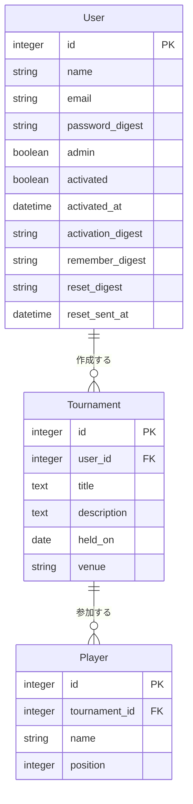

# Tennis'Ems

テニスのトーナメント大会を管理するWebアプリケーションです。大会の作成・選手登録・対戦組み合わせの管理ができます。

## 機能

- ユーザー登録・ログイン（メール認証、パスワードリセット）
- 大会の作成・閲覧・削除
- 大会への選手登録・ポジション割り当て

## 技術スタック

- Ruby 3.4 / Rails 8.1
- SQLite（開発・テスト） / PostgreSQL（本番）
- Bootstrap 3 / Turbo / Stimulus

## セットアップ

```bash
bundle install
bin/rails db:migrate
bin/rails db:seed      # サンプルデータ投入（任意）
bin/rails server
```

## テスト

```bash
bin/rails test
```

## ER図


